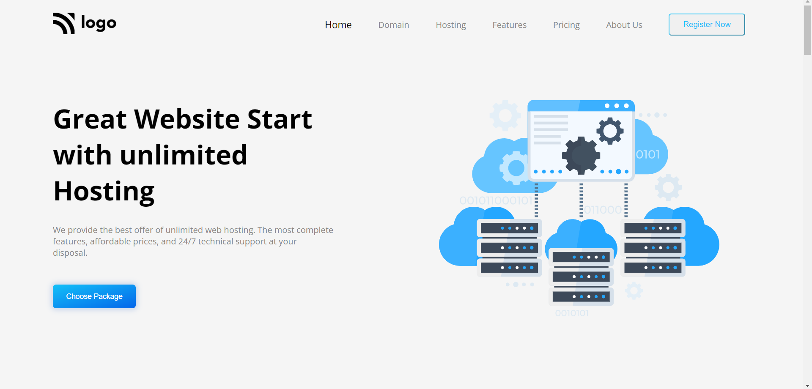

# Project 11

## Project 11 [Live link](https://hostingpagee.netlify.app/)

- Skills Gained in this project 
    - Learned to create linear gradient border using **::before** pseudo element.
    - Learned to create complex cards with different sections.
    
    

## Time Taken to Complete this project
    -9 Hours taken to Complete it.

### ScreenShot
 
